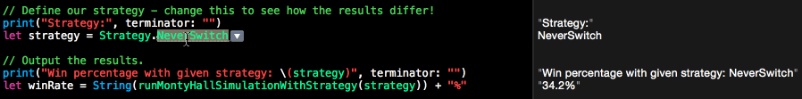

#[The Monty Hall Problem](https://en.wikipedia.org/wiki/Monty_Hall_problem)

>Suppose you're on a game show, and you're given the choice of three doors: Behind one door is a car; behind the others, >goats. You pick a door, say No. 1, and the host, who knows what's behind the doors, opens another door, say No. 3, >which has a goat. He then says to you, "Do you want to pick door No. 2?" Is it to your advantage to switch your choice?

It is quite counter-intuitive, but the correct answer is actually ***yes***, switching is always the best strategy. This program is a simple simulation that objectively shows that this is the case:

To explain ***why*** this is the case, I'll share what I think is the best explanation.
